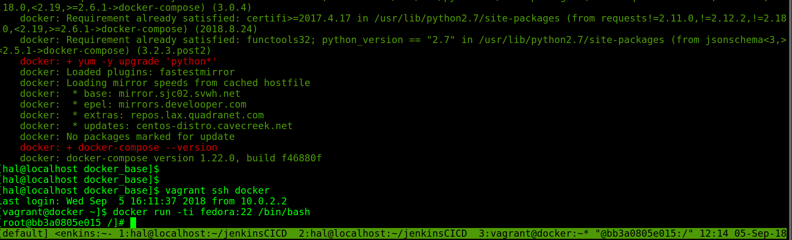

# Product Name
> Docker CE && Docker Compose && embedded in VAGRANT (sandbox dev) 

This setup will give you Docker CE w/ Compose running inside a VAGRANT setup. Ideal for those who need to test Docker or use
for other purposes.



## Installation

OS X & Linux:

```sh
#install Virtualbox && Vagrant on a headless linux server 
```

## Development setup

Run the following commands for a dev sandbox.

```sh
vagrant up 
```

Once completed run:
```sh
vagrant ssh docker
```

Once inside vagrant issue:
```sh
docker run -ti fedora:22 /bin/bash
```
Enjoy!
## Release History

* 0.0.1
    * Work in progress

## Meta

Simbalinux – admin@simbatek.net 

[https://github.com/simbalinux/docker](https://github.com/simbalinux/)

## Contributing

1. Fork it (<https://github.com/yourname/yourproject/fork>)
2. Create your feature branch (`git checkout -b feature/fooBar`)
3. Commit your changes (`git commit -am 'Add some fooBar'`)
4. Push to the branch (`git push origin feature/fooBar`)
5. Create a new Pull Request

